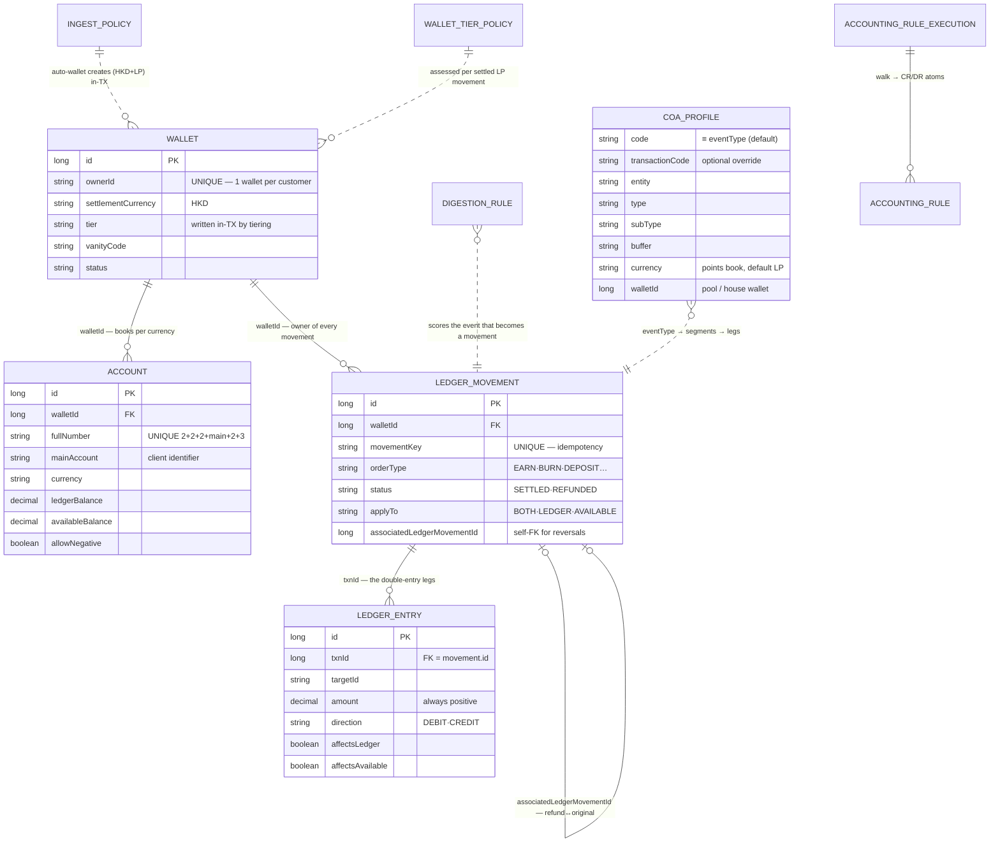
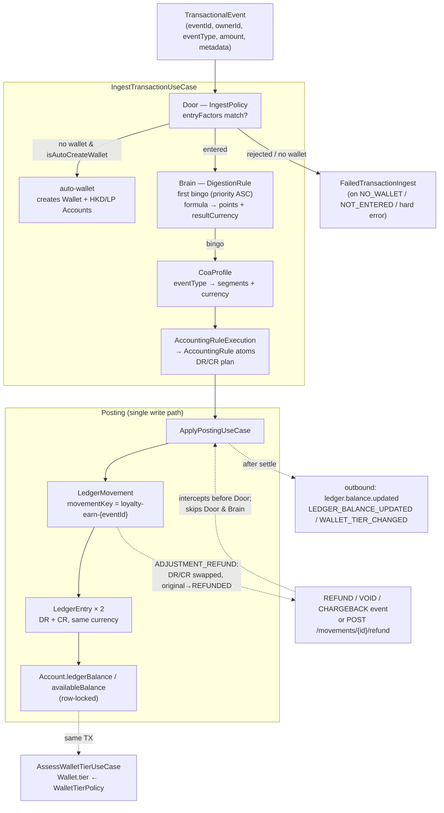

# LedgeRX — Object Relations

How the engine's objects relate: the persisted entity model (ER), then the runtime collaboration (who calls whom during one event). Entity fields below are taken from the actual `entity/po/*` classes in `src/main/java`.

> Companion docs: [BOOKLET.md](BOOKLET.md) (source of truth) · [SIMPLIFIED.md](SIMPLIFIED.md) (requirements & flow) · [GLOSSARY.md](GLOSSARY.md) (terms).

---

## 1 · Entity-relationship map



*(Dashed lines `..>` = logical/config-driven links resolved at runtime; solid `--` = persisted FK columns.)*

---

## 2 · The same map, grouped by role

```text
CONFIGURATION (ops-managed, "no redeploy")      TRANSACTIONAL (written by the engine)
┌───────────────────────────────┐               ┌──────────────────────────────────┐
│ IngestPolicy   (the Door)     │               │ Wallet  ──1:N──▶ Account         │
│   entryFactors                │               │   (balances live on Account)     │
│   isAutoCreateWallet ─────────┼──────────▶    │ Wallet.tier ◀── WalletTierPolicy │
│ DigestionRule  (the Brain)    │  admit &      │                                  │
│   whenFactors + formula       │  score        │ LedgerMovement ──1:N──▶ LedgerEntry
│   eventType, priority         │               │   movementKey (idempotency)      │
│ CoaProfile (the booking map)  │               │   associatedLedgerMovementId     │
│   code ≡ eventType            │               │     (refund → original)          │
│ CoaDictionary (finance terms) │               │ FailedTransactionIngest (dead    │
│ AccountingRuleExecution       │               │   letter queue: rawPayload,      │
│   └─▶ AccountingRule atoms    │               │   failureCode, replay)           │
└───────────────────────────────┘               └──────────────────────────────────┘
```

Config rows are **read** during ingest; transactional rows are **written** by posting. The two halves meet at `eventType`: policy, rule, profile, and event all carry the same token.

---

## 3 · Runtime collaboration — one CC_TXN event



---

## 4 · Relationship reference

| Relationship | Cardinality | Join / mechanism | Notes |
|---|---|---|---|
| Wallet → Account | **1 : N** | `account.walletId` | HKD + LP books minimum; balances live here |
| Wallet → LedgerMovement | **1 : N** | `movement.walletId` | Every movement belongs to one wallet |
| LedgerMovement → LedgerEntry | **1 : N (min 2)** | `entry.txnId = movement.id` | Legs: one DEBIT + one CREDIT |
| LedgerMovement → LedgerMovement | **0..1 : 0..1** | `associatedLedgerMovementId` (self-FK) | Reverse row points at original; original flips `REFUNDED` |
| Event → Movement | **N : 1** | `movementKey = loyalty-earn-{eventId}` | Idempotency: repeat `eventId` → `DUPLICATE`, existing row returned |
| IngestPolicy ⇢ Wallet | config → data | auto-wallet, same TX | Off → `NO_WALLET` |
| DigestionRule → outcome | config → data | `eventType` + `priority` + `whenFactors` | First bingo; no stacking |
| CoaProfile → legs | config → data | `code` (≡ `eventType`) → segments + `currency` | Also `walletId` → pool/house wallet (`HOUSE`, may go negative) |
| AccountingRuleExecution → AccountingRule | 1 : N | the walk | Direction, multiplier, target account per atom |
| WalletTierPolicy ⇢ Wallet.tier | config → data | assessed per settled LP movement, same TX | `LEDGER_BALANCE` criterion; upgradeAt/downgradeBelow bands |
| Movement → outbound events | 1 : N (async) | Kafka after settle | `ledger.balance.updated`, `WALLET_TIER_CHANGED` |
| Failed ingest → replay | 1 : 1 | `/integrations/failed-transactions/{id}/replay` | Stores `rawPayload` + `failureCode` |

---

## 5 · Rules the diagram encodes (read this before changing relations)

1. **One `ownerId` → one Wallet** — enforced unique; `WAL0409` on duplicate onboarding.
2. **Balances live only on Account**, mutated under lock, and **only** via `ApplyPostingUseCase`. Any other write path = drift.
3. **Movement ↔ legs invariant**: Σ DEBIT = Σ CREDIT, same currency, amounts stored positive + `MovementDirection`.
4. **Idempotency is a unique key**, not a check-then-insert: `movementKey` dedupes earns/burns; `{originalKey}-refund` dedupes all three reverse actions.
5. **Refunds are movements too** — a new `ADJUSTMENT_REFUND` movement linked back via `associatedLedgerMovementId`, never an update to the original (except status → `REFUNDED`).
6. **`applyTo` rides on the movement** (`BOTH`/`LEDGER`/`AVAILABLE`); entries carry `affectsLedger` / `affectsAvailable` flags derived from it.
7. **Config is data**: Door, Brain, COA, tiering are rows in Postgres — changing scoring needs no deploy, and entries in this doc's left column never hard-reference a wallet or customer.
8. **Tiering writes in the posting TX** (`wallet.tier`), not via a later Kafka consumer — the Kafka events are announcements, not the source of tier truth.

---

*Source of entity fields: `src/main/java/com/altech/ledger/entity/po/**` (FK verified in `LedgerMovementExecutionUseCase`). Diagrams are mermaid — render on GitHub or any mermaid-capable viewer.*
